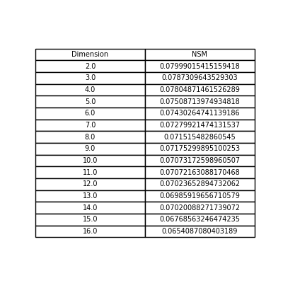
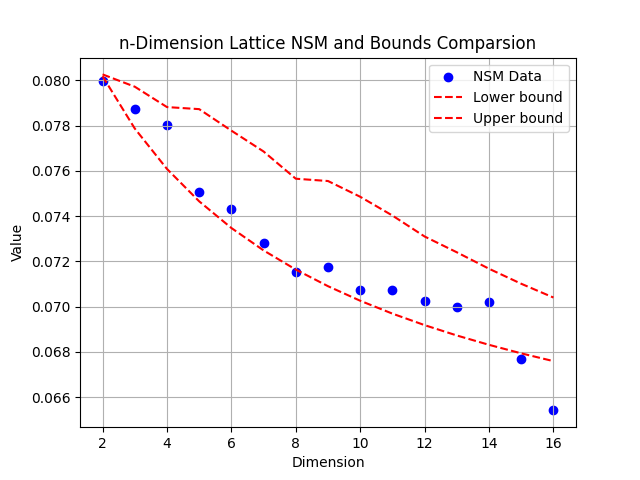

# 机器学习大作业实验报告

## 概述

本实验主要基于论文 **_Opitimization and Identification of Lattice Quantiziers_**，利用迭代方法构建和分析晶格结构。实验的主要部分由两个Python脚本实现：`iteration.py` 和 `NBR.py`。

## 代码分析

### iteration.py

#### 功能描述

`iteration.py` 脚本负责解析命令行参数，并使用迭代方法构建晶格。脚本中的主要函数是 `iterative_lattice_construction`，该函数根据提供的参数生成晶格矩阵 `B`。

#### 命令行参数

- `--n`: 晶格的维度 (默认值: 10)
- `--T`: 迭代次数 (默认值: 1,000,000)
- `--Tr`: 间隔 (默认值: 100)
- `--u0`: 初始步长 (默认值: 0.005)
- `--v`: 比率 (默认值: 200)

#### 使用示例

```sh
python iteration.py --n 10 --T 1000000 --Tr 100 --u0 0.005 --v 200
```

### NBR.py

#### 功能描述

`NBR.py` 脚本导入 `iteration` 模块，并定义了用于解码晶格点和计算给定半径内晶格点数量的函数。主要函数是 `decode` 和 `compute_NBR`。

#### 函数说明

- `decode(H, ep)`: 使用下三角生成矩阵 `H` 解码最接近给定点 `x` 的晶格点。
- `compute_NBR(B, r)`: 使用生成矩阵 `B` 计算距离原点半径 `r` 内的晶格点数量的下界。

#### 示例矩阵

脚本中包含几个示例矩阵 (`B2`, `B3`, `B4`, `B10`)，并计算了 `B10` 在半径 `sqrt(2)` 内的晶格点数量。

#### 输出示例

```sh
Final generate matrix B: [[...], [...], ...]
Final NSM: ...
```

### data.py

#### 功能描述

- `data.py` 脚本将利用 `iteration.py` 计算出的格的NSM数据与论文示例进行对比，并生成相对应的图表。

#### 输出示例

两张图表。

## 实验步骤

1. 使用所需参数运行 `iteration.py` 脚本：
   
   ```sh
   python iteration.py --n 10 --T 1000000 --Tr 100 --u0 0.005 --v 200
   ```
2. 运行 `NBR.py` 脚本以计算给定半径内的晶格点数量：
   ```sh
   python NBR.py
   ```

## 结果分析

按照上述步骤计算出2-16维的格的生成矩阵，进一步得到它们的NSM估计。

### NSM




与论文示例范围进行对比绘制出的图表显示，计算所得到的NSM在2-14维度均在示例范围内，可验证在低维度下得到的结果接近最优矩阵。

观察发现在15和16维度计算结果有所偏离，在15维度使用论文示例矩阵进行计算，得到的NSM结果略低于实验所得NSM结果和论文的示例范围，据此推断误差来源于NSM函数的计算，同时，根据论文中矩阵在同样的NSM函数中计算结果更优，推断在维度提高，而使用的迭代参数、步长参数不改变的情况下，实验所得的矩阵与论文中的最优矩阵仍有一些差距。

### 矩阵

对应的矩阵存储在 `example.txt` 下。比较低维度矩阵，例如n=2的情况，计算结果与设想的标准的二维最优格数值不完全相等，但计算其基向量后，与标准二维最优格进行对比，发现形成的格基本相同。

迭代出的矩阵未能在形式上达到最优矩阵的形态，与其行列式始终保持为1有关。标准的二维最优矩阵行列式不为1，而分析 `example.txt` 中的所有迭代结果，发现其行列式均以非常小的差距接近1，从而导致程序迭代无法直接得到矩阵的最优形式。

## 基于结果的优化


## 结论

本次实验主要分析并实现了参考论文中提出的对于格量化器的数值优化方法，计算出了2-16维的格型数据，并对计算结果进行了分析。

## 参考文献

**Optimization and Identification of Lattice Quantizers**、**On the Best Lattice Quantizers**、**Closest point search in lattices**、**Faster Recursions in Sphere Decoding**

## 小组分工

